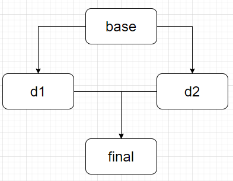
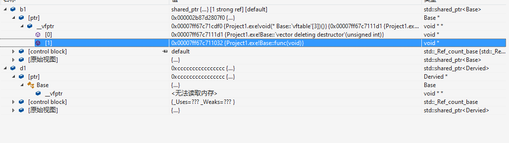

## C++虚函数，虚继承，多态，虚函数

鉴于面试一直要问，重新补补基础

### 1 虚函数

首先了解一下纯虚函数，代码,这段会直接报错，“base”: 无法实例化抽象类。

```
class base {
public:

	base():baset(2){ cout << "base call" << endl; }
	virtual void func() = 0;
	virtual ~base() { cout << "base deconst" << endl; }
private:
	int baset;

};

class derive1:public base{
public:
	derive1():d1(2) { cout << "derive1 call" << endl; };
	void func() { cout << "?" << endl; }
	~derive1() { cout << "derive1 deconst" << endl; }
private:
	int d1;
};

int main() {
	base a;
	derive1 b;
	cout << sizeof(a) << ' ' << endl;
}
```

拥有纯虚函数的类，更像是接口的声明，是对子类的约束。这个类就叫做抽象类，不能被实例化。

更进一步，基类的派生类可以继续是抽象类，但还是无法实例化，直到是完全实例化类。

### 2 虚继承

虚继承主要是为了解决菱形继承的问题

```cpp
#include <iostream>

using namespace std;

class base {
public:

	base():baset(2){ cout << "base call" << endl; }
	//virtual void func() = 0;
	virtual ~base() { cout << "base deconst" << endl; }

	int baset;
};

class derive1:public base{
public:
	derive1():d1(2) { cout << "derive1 call" << endl; };
	~derive1() { cout << "derive1 deconst" << endl; }
private:
	int d1;
};

class derive2 :public base {
public:
	derive2() { cout << "build 2" << endl; }
	~derive2() { cout << "delete 2" << endl; }
private:
	int d2;
};

class final:public derive1 ,public derive2 {
public:
	final() { cout << "build f" << endl; }
	~final() { cout << "delete f" << endl; }
private:
	int f;
};

int main() {
	final a;
	cout << a.baset << endl;
	//cout << a.derive2::baset << endl;
}
```

这段代码最后会出现对baset的访问不明确的错误,解决方法也比较明确，就是直接确定从那条路访问就行了。



实际上，在final中会有两份baset的副本，这显然是设计上不想要的。之后引入虚继承

```
#include <iostream>

using namespace std;


class base {
public:

	base():baset(2){ cout << "base call" << endl; }
	//virtual void func() = 0;
	virtual ~base() { cout << "base deconst" << endl; }

	int baset;
};

class derive1:virtual public base{
public:
	derive1():d1(2) { cout << "derive1 call" << endl; };
	~derive1() { cout << "derive1 deconst" << endl; }
private:
	int d1;
};

class derive2 :virtual public base {
public:
	derive2():d2(2) { cout << "build 2" << endl; }
	~derive2() { cout << "delete 2" << endl; }
private:
	int d2;
};

class final:public derive1 ,public derive2 {
public:
	final() : f(2) { cout << "build f" << endl; }
	~final() { cout << "delete f" << endl; }
private:
	int f;
};

int main() {
	final a;
	cout << a.baset << endl;
}
```

### 3 多态

c++多态有编译多态和运行多态，编译多态主要靠重载，C++的运行时多态主要就是通过虚函数等方式实现的。

```
#include <iostream>
using namespace std;
class Base
{
public:
	virtual void func() { cout << "Base func() called." << endl; }
};
class Dervied : public Base
{
public:
	void func() { cout << "Dervied func() called." << endl; }
};

int main()
{
	Base* b = new Dervied();
	b->func();
	return 0;
}
```

输出

```
Dervied func() called.
```

base类的指针，调用到了派生类的属性，如果virtual被删除，输出被裁减。派生类的方法就不会去覆盖基类，从而无法调用派生类的方法。

```
Base func() called.
```

如果基类的析构函数不虚

```
#include <iostream>
using namespace std;
class Base
{
public:
	Base() { cout << "Base() called." << endl; }
	~Base() { cout << "~Base() called." << endl; }
	//void func() { cout << "Base func() called." << endl; }
};
class Dervied : public Base
{
public:
	Dervied() { cout << "Dervied() called." << endl; }
	~Dervied() { cout << "~Dervied() called." << endl; }
	//void func() { cout << "Dervied func() called." << endl; }
};

int main()
{
	Base* b = new Dervied();
	delete b;
	return 0;
}
```

输出就是,直接导致了一个泄露

```
Base() called.
Dervied() called.
~Base() called.
```

如果使用智能指针，确实会最后释放。但是这个类在设计上就是不合适的。

```
#include <iostream>
using namespace std;
class Base
{
public:
	Base() { cout << "Base() called." << endl; }
	~Base() { cout << "~Base() called." << endl; }
	//void func() { cout << "Base func() called." << endl; }
};
class Dervied : public Base
{
public:
	Dervied() { cout << "Dervied() called." << endl; }
	~Dervied() { cout << "~Dervied() called." << endl; }
	//void func() { cout << "Dervied func() called." << endl; }
};

int main()
{
	shared_ptr<Base> b = make_shared<Dervied>();
	return 0;
}
```

所以，如果要考虑多态的话，记得几个关键的函数，要设置为virtual

### 4 虚表和虚函数指针

```
#include <iostream>
using namespace std;
class Base
{
public:
	Base() { cout << "Base() called." << endl; }
	virtual ~Base() { cout << "~Base() called." << endl; }
	virtual void func() { cout << "Base func() called." << endl; }
};
class Dervied : public Base
{
public:
	Dervied() { cout << "Dervied() called." << endl; }
	~Dervied() { cout << "Dervied() called." << endl; }
	void func() { cout << "Dervied func() called." << endl; }
};

int main()
{
	shared_ptr<Base> b1(new Derived());
	shared_ptr<Dervied> d1(new Dervied());
	return 0;
}
```



```
#include <iostream>
using namespace std;
class Base
{
public:
	Base() { cout << "Base() called." << endl; }
	virtual ~Base() { cout << "~Base() called." << endl; }
	virtual void func() { cout << "Base func() called." << endl; }
};
class Dervied : public Base
{
public:
	Dervied() { cout << "Dervied() called." << endl; }
	~Dervied() { cout << "Dervied() called." << endl; }
	void func() { cout << "Dervied func() called." << endl; }
};

int main()
{
	shared_ptr<Base> b1(new Dervied());
	shared_ptr<Dervied> d1(new Dervied());
	puts("");
	b1->func();
	puts("");
	return 0;
}
```

再看的时候发现base的vptr指向的是Derive的函数

另外把基类的指针付给派生类，b1的虚函数表的长度为4，而d1的虚函数表的长度为5。Dervied类对象指针本该接收一个长度为5的虚函数表，可是你给它传了一个Base类属性，这个Base类只有长度为4的虚函数表，没办法填满这个长度为5的虚函数表。

实际调用这个func的时候因为在虚表跳转，但是这个地址找不到，就直接崩了。

派生类继承了基类的所有public虚函数，可以从大的往小了裁剪，但是不能小的填到大的里面。

### 5 类大小

空类是1，别的实际sizeof一下就知道了