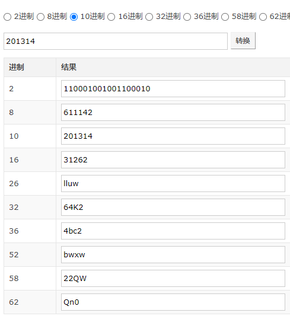

## 短网址解析

短网址的优势还是挺多的，在字数限制等场景下优势还是挺明显的

### 具体实现

在浏览器输入一个短网址的时候

1. dns首先会解析获得短址之前的域名ip
2. 之后去get请求，查询短码的id
3. 获取到具体的长URL
4. 之后返回301，重定向到真实URL

注意301是永久重定向，服务器的压力在这种情况下会减少很多,相比于302

### 算法实现

自增序列算法就够用了，其实就是一个kv一对一的关系。

设置一个id自增，转换位63进数。一般短地址都有6位，每一个总共62个可能取值，6位的话一个626,大概也够用了。具体可以看如下，低进制转高进制，字符数会大幅度的减少。

进制转换工具比较实用的有：[link](https://tool.lu/hexconvert/)

