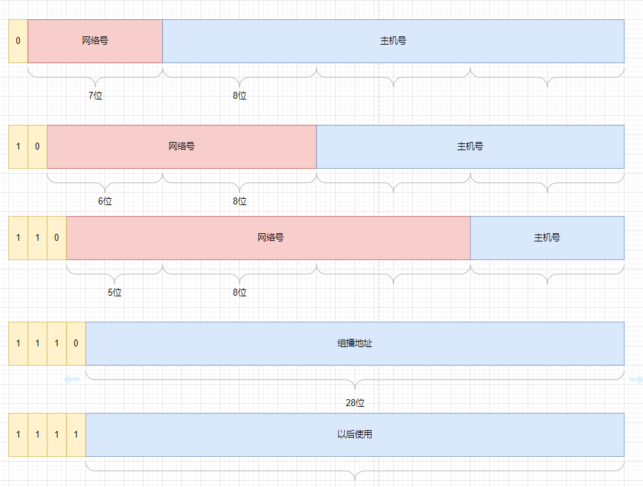

## IP

网络层主要是实现机器间的通信，点对点。相比而言，mac的作用是两个直连设备间的通信，ip主要是负责在没有直连的两个网络间进行通信。

### 相关定义和基础

IP（v4）地址是32位正整数，在计算机中二进制，为了看起来像个人看的才用点分10进给你看的。

最多允许2<sup>32</sup>台机器连接网络

实际看这是不够的哈，会根据⼀种可以更换 IP 地址的技术NAT ，使得可连接计算机数超过 43 亿台

### 地址分类

一共5类，A类、B类、C类、D类、E类，从上到小



具体地址范围如下

| 类别 |          地址范围           | 最大主机数 |
| :--: | :-------------------------: | :--------: |
|  A   |  0.0.0.0 - 127.255.255.255  |  16777214  |
|  B   | 128.0.0.0 - 191.255.255.255 |   65534    |
|  C   | 192.0.0.0 - 223-255.255.255 |    254     |

计算方式就是看主机号的，比如c类的话(减2是因为全1和全0是特殊地址)

2<sup>8</sup> - 2 = 254

其中主机号全1指定某个网络下的广播地址，全0指定某个网络

⽽ D 类和 E 类地址是没有主机号的，所以不可⽤于主机 IP，D 类常被⽤于多播，E 类是预留的分类，暂时未使 ⽤。

### 分类的优点

能用状态机比较快的判断出当前地址属于哪一类

### 无分类地址

其实分类不一定能和实际问题的范围匹配，所以提出了CIDR地址，前面网络号，后面主机号

```
a.b.c.d/x
```

其中x表示前x位属于网络号，剩下的几位是主机号

还有一种就是子网掩码，主机号的部分全0，和ip与之后就拿到了网络号

### 关于IP分片与重组

每种数据链路的最⼤传输单元MTU 都是不相同的，如 FDDI 数据链路MTU4352、以太⽹的 MTU 是 1500 字节等。

其中，我们最常⻅数据链路是以太⽹，它MTU是1500字节，大于他的时候IP就会进行分片，重组的时候只能由目标主机进行重组，路由器是不会做这的

在分⽚传输中，⼀旦某个分⽚丢失，则会造成整个 IP 数据报作废，所以 TCP上有 MSS 也就是在 TCP 层进行分片不由 IP 层分⽚，那么对于 UDP 我们尽量不要发送⼀个大于MTU的数据报文。

### 网络层常见的协议

#### DNS

一般的网址访问都是域名，DNS 域名解析在此处发挥作用，DNS 可以将域名⽹址⾃动转换为具体的 IP 地址

在域名中，越靠右的位置表示其层级越⾼。

+ 根 DNS 服务器
+ 顶级域 DNS 服务器（com） 
+ 权威 DNS 服务器（server.com）

客户端只要能够找到任意⼀台 DNS 服务器，就可以通过它找到根域 DNS 服务器，然后再⼀路顺藤摸⽠找到 位于下层的某台⽬标 DNS 服务器。

#### ARP

在传输⼀个 IP 数据报的时候，确定了源 IP 地址和⽬标 IP 地址后，就会通过主机「路由表」确定 IP 数据包下⼀ 跳。然⽽，⽹络层的下⼀层是数据链路层，所以我们还要知道「下⼀跳」的 MAC 地址

由于主机的路由表中可以找到下⼀跳的 IP 地址，所以可以通过  ARP 协议，求得下⼀跳的 MAC 地址

当前会广播一个ip地址，此链路中的ip地址和自己一致的时候就会返回自己的mac地址在arp响应包里返回

一般这个地址会被缓存，有一个期限。

#### DHCP

常见的动态获取ip，全程都是udp通信的，就是客户端请求一个ip地址带租期，服务端返回这个详细信息

#### NAT

ipv4耗尽的速度快，提出了⼀种⽹络地址转换 NAT 的⽅法，再次缓解了 IPv4 地址耗尽的问题。

就是内部对外公网通信的时候，把私有ip地址转换成公网ip（ip+端口）

#### ICMP

Internet Control Message Protocol，互联⽹控制报⽂协议。

确认 IP 包是否成功送达⽬标地址、报告发送过程中 IP 包被废弃的原因和改善⽹络设置 等。

在IP 通信中如果某个IP包因为某种原因未能达到⽬标地址，那么这个具体的原因将由 ICMP 负责通知

大致分为两大类

1. ⼀类是⽤于诊断的查询消息，也就查询报⽂类型
2. 另⼀类是通知出错原因的错误消息，也就是差错报文类型

