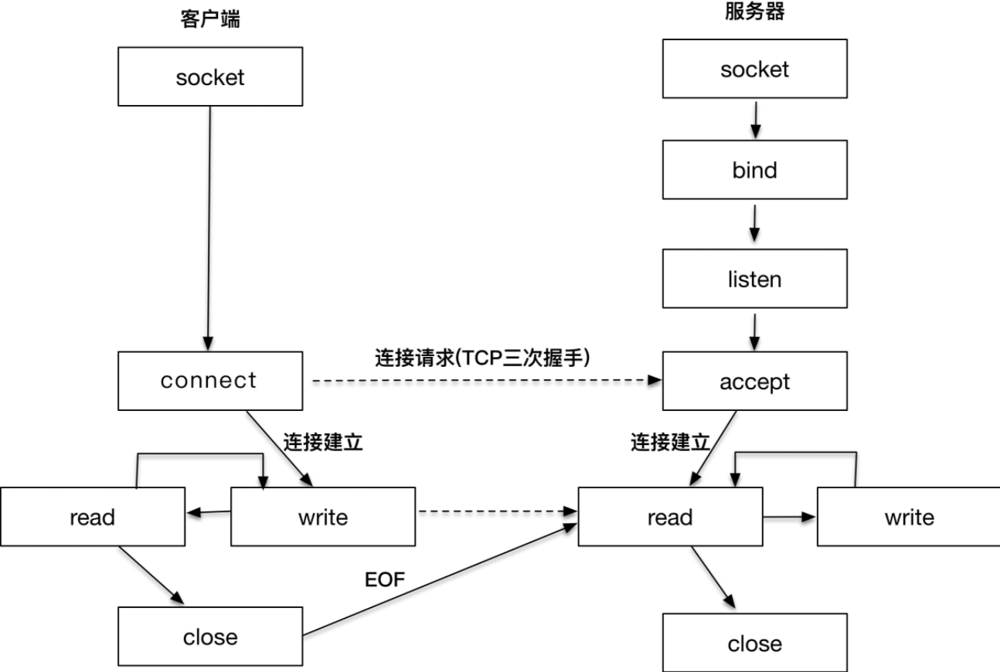

## 套接字和地址以及连接的建立



服务端的步骤大致分为4步：

1. 初始socket
2. bind一个地址和端口
3. 监听，讲原先的socket转化为服务端的socket
4. 最后阻塞在accept等待客户端请求的到来

之后这个过程完成之后，双端连接建立进入了双工通信的阶段。具体来说，客户端进程向操作系统内核发起 write 字节流写操作，内核协议栈将字节流通过网络设备传输到服务器端，服务器端从内核得到信息，将字节流从内核读入到进程中，并开始业务逻辑的处理，完成之后，服务器端再将得到的结果以同样的方式写给客户端。

交互完成之后，需要断开，就会执行 close 函数，操作系统内核此时会通过原先的连接链路向服务器端发送一个 FIN 包，服务器收到之后执行被动关闭，这时候整个链路处于半关闭状态，此后，服务器端也会执行 close 函数，整个链路才会真正关闭。半关闭的状态下，发起 close 请求的一方在没有收到对方 FIN 包之前都认为连接是正常的；而在全关闭的状态下，双方都感知连接已经关闭。

socket的fd是我们通信传输数据的唯一方式

### 通用套接字

```

/* POSIX.1g 规范规定了地址族为2字节的值.  */
typedef unsigned short int sa_family_t;
/* 描述通用套接字地址  */
struct sockaddr{
    sa_family_t sa_family;  /* 地址族.  16-bit*/
    char sa_data[14];   /* 具体的地址值 112-bit */
}; 
```

第一个字段是地址族，它表示使用什么样的方式对地址进行解释和保存，AF表示address family，常用的其实也就三种：

1. AF_LOCAL：表示的是本地地址，对应的是 Unix 套接字，这种情况一般用于本地 socket 通信，很多情况下也可以写成 AF_UNIX、AF_FILE；
2. AF_INET：因特网使用的 IPv4 地址；
3. AF_INET6：因特网使用的 IPv6 地址。

很多情况下，也厂看到PF开头的地址族，AF_xxx 这样的值来初始化 socket 地址，用 PF_xxx 这样的值来初始化 socket。我们在 头文件中可以清晰地看到，这两个值本身就是一一对应的。

```

/* 各种地址族的宏定义  */
#define AF_UNSPEC PF_UNSPEC
#define AF_LOCAL  PF_LOCAL
#define AF_UNIX   PF_UNIX
#define AF_FILE   PF_FILE
#define AF_INET   PF_INET
#define AF_AX25   PF_AX25
#define AF_IPX    PF_IPX
#define AF_APPLETALK  PF_APPLETALK
#define AF_NETROM PF_NETROM
#define AF_BRIDGE PF_BRIDGE
#define AF_ATMPVC PF_ATMPVC
#define AF_X25    PF_X25
#define AF_INET6  PF_INET6
```

### IPv4专有套接字

```

/* IPV4套接字地址，32bit值.  */
typedef uint32_t in_addr_t;
struct in_addr
{
    in_addr_t s_addr;
};
  
/* 描述IPV4的套接字地址格式  */
struct sockaddr_in
{
    sa_family_t sin_family; /* 16-bit */
    in_port_t sin_port;     /* 端口号  16-bit,65536 */
    struct in_addr sin_addr;    /* Internet address. 32-bit */


    /* 这里仅仅用作占位符，不做实际用处  */
    unsigned char sin_zero[8];
};
```

这里提一手知名端口，如 ftp 的 21 端口，ssh 的 22 端口，http 的 80 端口等。一般而言，大于 5000 的端口可以作为我们自己应用程序的端口使用。

### IPv6套接字

```
struct sockaddr_in6
{
    sa_family_t sin6_family; /* 16-bit */
    in_port_t sin6_port;  /* 传输端口号 # 16-bit */
    uint32_t sin6_flowinfo; /* IPv6流控信息 32-bit*/
    struct in6_addr sin6_addr;  /* IPv6地址128-bit */
    uint32_t sin6_scope_id; /* IPv6域ID 32-bit */
};
```

### 本地套接字

```
struct sockaddr_un {
    unsigned short sun_family; /* 固定为 AF_LOCAL */
    char sun_path[108];   /* 路径名 */
};
```

这个本地套接字是用来做为进程间通信使用的，即AF_LOCAL，其中，本地地址结构的长度是可变的

### 如何建立连接

#### 首先要准备好socket,创建一个

```
int socket(int domain, int type, int protocol)
```

domain 就是指 PF_INET、PF_INET6 以及 PF_LOCAL 等，表示什么样的套接字。

type 可用的值是：

+ SOCK_STREAM: 表示的是字节流，对应 TCP；
+ SOCK_DGRAM： 表示的是数据报，对应 UDP；
+ SOCK_RAW: 表示的是原始套接字。

参数 protocol 原本是用来指定通信协议的，但现在基本废弃。因为协议已经通过前面两个参数指定完成。protocol 目前一般写成 0 即可。

#### 之后要把这个套接字命名

```
bind(int fd, sockaddr * addr, socklen_t len)
```

需要注意的是，虽然第二个参数是通用套接字，但实际上会根据第三个参数判断addr如何去解析

然后如果一台机器有多个ip的话，还可以设置通配地址,对于ipv4,INADDR_ANY ,对于ipv6就是IN6ADDR_ANY

```
struct sockaddr_in name;
name.sin_addr.s_addr = htonl (INADDR_ANY); /* IPV4通配地址 */
```

另外如果端口设置成0，就是把选择全交给了操作系统，系统会给你分配一个端口，完成套接字的绑定。

```
#include <stdio.h>
#include <stdlib.h>
#include <sys/socket.h>
#include <netinet/in.h>


int make_socket (uint16_t port)
{
  int sock;
  struct sockaddr_in name;


  /* 创建字节流类型的IPV4 socket. */
  sock = socket (PF_INET, SOCK_STREAM, 0);
  if (sock < 0)
    {
      perror ("socket");
      exit (EXIT_FAILURE);
    }


  /* 绑定到port和ip. */
  name.sin_family = AF_INET; /* IPV4 */
  name.sin_port = htons (port);  /* 指定端口 */
  name.sin_addr.s_addr = htonl (INADDR_ANY); /* 通配地址 */
  /* 把IPV4地址转换成通用地址格式，同时传递长度 */
  if (bind (sock, (struct sockaddr *) &name, sizeof (name)) < 0)
    {
      perror ("bind");
      exit (EXIT_FAILURE);
    }


  return sock
}
```

#### 之后就需要listen进行监听

```
int listen (int socketfd, int backlog)
```

最开始完成命名的套接字经过这一步之后，就变成等待请求的被动套接字。第二个参数 backlog，在 Linux 中表示已完成 (ESTABLISHED) 且未 accept 的队列大小，这个参数的大小决定了可以接收的并发数目。这个参数越大，并发数目理论上也会越大。但是参数过大也会占用过多的系统资源。

#### 再进行accept

```
int accept(int listensockfd, struct sockaddr *cliaddr, socklen_t *addrlen)
```

这个的返回值是一个已连接套接字描述字，监听套接字就是之前进行listen和bind的那个。它是要为成千上万的客户来服务的，直到这个监听套接字关闭；而一旦一个客户和服务器连接成功，完成了 TCP 三次握手，操作系统内核就为这个客户生成一个已连接套接字，让应用服务器使用这个已连接套接字和客户进行通信处理

### 客户端的连接建立

客户端的第一步和服务端一样，第二部就直接connect了

```
int connect(int sockfd, const struct sockaddr *servaddr, socklen_t addrlen)
```

servaddr 和 addrlen 分别代表指向套接字地址结构的指针和该结构的大小。套接字地址结构必须含有服务器的 IP 地址和端口号。

客户在调用函数 connect 前不必非得调用 bind 函数，因为如果需要的话，内核会确定源 IP 地址，并按照一定的算法选择一个临时端口作为源端口

如果是 TCP 套接字，那么调用 connect 函数将激发 TCP 的三次握手过程，而且仅在连接建立成功或出错时才返回。其中出错返回可能有以下几种情况：

1. 三次握手无法建立，客户端发出的 SYN 包没有任何响应，于是返回 TIMEOUT 错误。这种情况比较常见的原因是对应的服务端 IP 写错。
2. 客户端收到了 RST（复位）回答，这时候客户端会立即返回 CONNECTION REFUSED 错误。这种情况比较常见于客户端发送连接请求时的请求端口写错，因为 RST 是 TCP 在发生错误时发送的一种 TCP 分节。产生 RST 的三个条件是：目的地为某端口的 SYN 到达，然而该端口上没有正在监听的服务器（如前所述）；TCP 想取消一个已有连接；TCP 接收到一个根本不存在的连接上的分节。
3. 客户发出的 SYN 包在网络上引起了"destination unreachable"，即目的不可达的错误。这种情况比较常见的原因是客户端和服务器端路由不通

