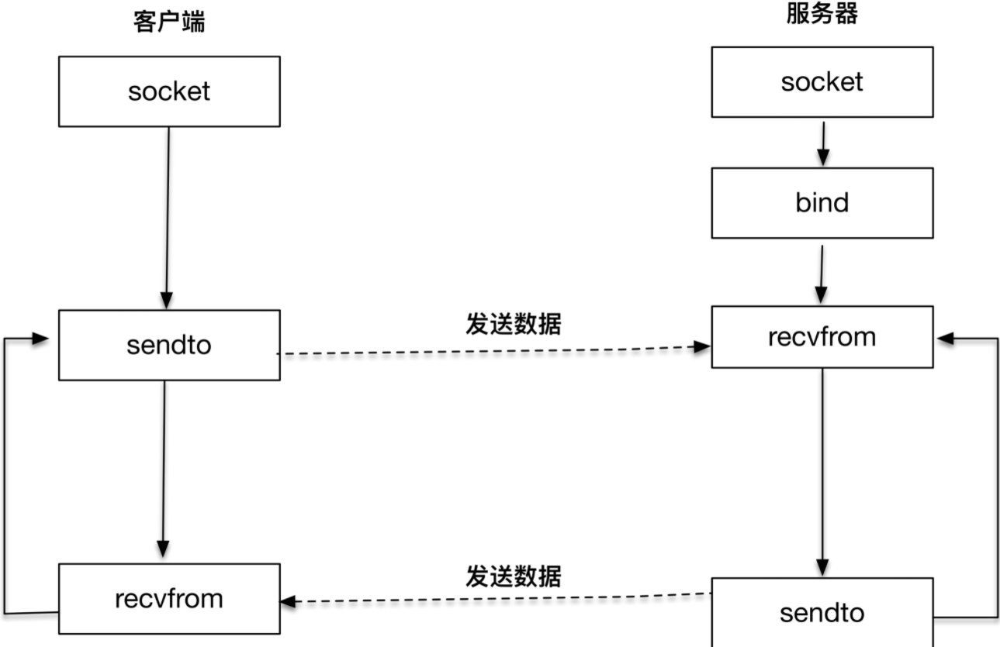

## UDP

TCP 是一个面向连接的协议，TCP 在 IP 报文的基础上，增加了诸如重传、确认、有序传输、拥塞控制等能力，通信的双方是在一个确定的上下文中工作的。

而 UDP 则不同，UDP 没有这样一个确定的上下文，它是一个不可靠的通信协议，没有重传和确认，没有有序控制，也没有拥塞控制。我们可以简单地理解为，在 IP 报文的基础上，UDP 增加的能力有限。

UDP 不保证报文的有效传递，不保证报文的有序，也就是说使用 UDP 的时候，我们需要做好丢包、重传、报文组装等工作。

UDP 比较简单，适合的场景还是比较多的，我们常见的 DNS 服务，SNMP 服务都是基于 UDP 协议的，这些场景对时延、丢包都不是特别敏感。另外多人通信的场景，如聊天室、多人游戏等，也都会使用到 UDP 协议。

### Coding



```
#include <sys/socket.h>

ssize_t recvfrom(int sockfd, void *buff, size_t nbytes, int flags, 
　　　　　　　　　　struct sockaddr *from, socklen_t *addrlen); 

ssize_t sendto(int sockfd, const void *buff, size_t nbytes, int flags,
                const struct sockaddr *to, socklen_t addrlen); 
```

1. recvfrom

sockfd、buff 和 nbytes 是前三个参数。sockfd 是本地创建的套接字描述符，buff 指向本地的缓存，nbytes 表示最大接收数据字节。

第四个参数 flags 是和 I/O 相关的参数，暂时设置为0

后面两个参数 from 和 addrlen，实际上是返回对端发送方的地址和端口等信息，这和 TCP 非常不一样，TCP 是通过 accept 函数拿到的描述字信息来决定对端的信息。另外 UDP 报文每次接收都会获取对端的信息，也就是说报文和报文之间是没有上下文的。

函数的返回值告诉我们实际接收的字节数。

2. sendto

sendto 函数中的前三个参数为 sockfd、buff 和 nbytes。sockfd 是本地创建的套接字描述符，buff 指向发送的缓存，nbytes 表示发送字节数。第四个参数 flags 依旧设置为 0。

后面两个参数 to 和 addrlen，表示发送的对端地址和端口等信息。

函数的返回值告诉我们实际发送的字节数

UDP的工作流程类似于：

接收 A→发送 A→接收 B→发送 B →接收 C→发送 C→ …

### 服务端

```c
#include "header.h"

static int count;

static void recvfrom_int(int signo) {
    printf("\nreceived %d datagrams\n", count);
    exit(0);
}


int main(int argc, char **argv) {
    int socket_fd;
    socket_fd = socket(AF_INET, SOCK_DGRAM, 0);

    struct sockaddr_in server_addr;
    bzero(&server_addr, sizeof(server_addr));
    server_addr.sin_family = AF_INET;
    server_addr.sin_addr.s_addr = htonl(INADDR_ANY);
    server_addr.sin_port = htons(SERV_PORT);

    bind(socket_fd, (struct sockaddr *) &server_addr, sizeof(server_addr));

    socklen_t client_len;
    char message[MAXLINE];
    count = 0;

    signal(SIGINT, recvfrom_int);

    struct sockaddr_in client_addr;
    client_len = sizeof(client_addr);
    for (;;) {
        int n = recvfrom(socket_fd, message, MAXLINE, 0, (struct sockaddr *) &client_addr, &client_len);
        message[n] = 0;
        printf("received %d bytes: %s\n", n, message);

        char send_line[MAXLINE];
        sprintf(send_line, "Hi, %s", message);

        sendto(socket_fd, send_line, strlen(send_line), 0, (struct sockaddr *) &client_addr, client_len);

        count++;
    }

}
```

### 客户端

```c
#include "header.h"

# define    MAXLINE     4096

int main(int argc, char **argv) {
    if (argc != 2) {
        error(1, 0, "usage: udpclient <IPaddress>");
    }
    
    int socket_fd;
    socket_fd = socket(AF_INET, SOCK_DGRAM, 0);

    struct sockaddr_in server_addr;
    bzero(&server_addr, sizeof(server_addr));
    server_addr.sin_family = AF_INET;
    server_addr.sin_port = htons(SERV_PORT);
    inet_pton(AF_INET, argv[1], &server_addr.sin_addr);

    socklen_t server_len = sizeof(server_addr);

    struct sockaddr *reply_addr;
    reply_addr = malloc(server_len);

    char send_line[MAXLINE], recv_line[MAXLINE + 1];
    socklen_t len;
    int n;

    while (fgets(send_line, MAXLINE, stdin) != NULL) {
        int i = strlen(send_line);
        if (send_line[i - 1] == '\n') {
            send_line[i - 1] = 0;
        }

        printf("now sending %s\n", send_line);
        size_t rt = sendto(socket_fd, send_line, strlen(send_line), 0, (struct sockaddr *) &server_addr, server_len);
        if (rt < 0) {
            error(1, errno, "send failed ");
        }
        printf("send bytes: %zu \n", rt);

        len = 0;
        n = recvfrom(socket_fd, recv_line, MAXLINE, 0, reply_addr, &len);
        if (n < 0)
            error(1, errno, "recvfrom failed");
        recv_line[n] = 0;
        fputs(recv_line, stdout);
        fputs("\n", stdout);
    }

    exit(0);
}
```

### 总结：

1. UDP 是无连接的数据报程序，和 TCP 不同，不需要三次握手建立一条连接。可以用上面的程序分别建立客户端，服务端，多试试

2. UDP 程序通过 recvfrom 和 sendto 函数直接收发数据报报文。

3. 用UDP协议发送时，用sendto函数最大能发送数据的长度为：65535- IP头(20) - UDP头(8)＝65507字节。用sendto函数发送数据时，如果发送数据长度大于该值，则函数会返回错误。

4. 由于IP有最大MTU，因此，UDP 包的大小应该是：

   > 1500 - IP头(20) - UDP头(8) = 1472(Bytes)

   TCP 包的大小应该是 :
   
   > 1500 - IP头(20) - TCP头(20) = 1460 (Bytes)

