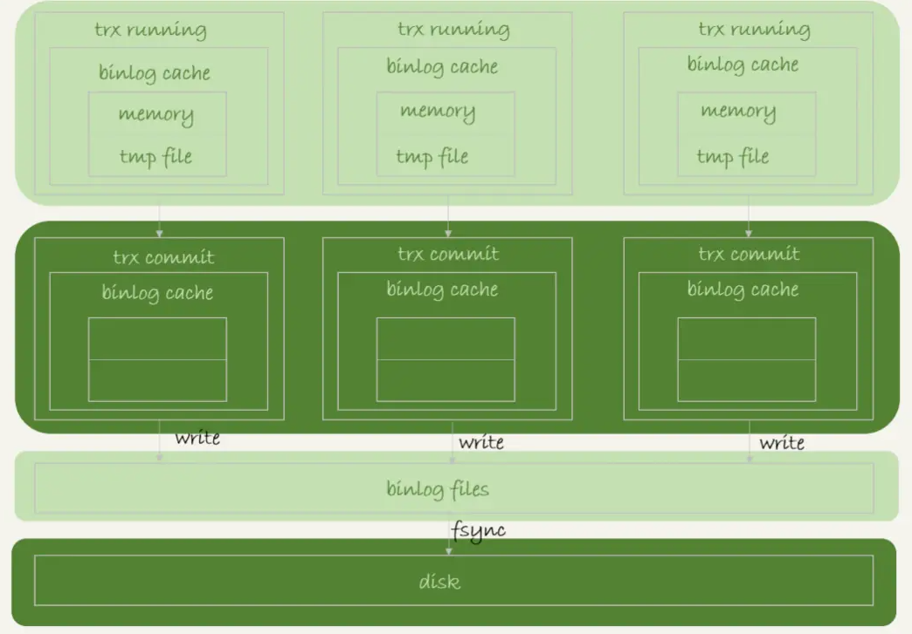
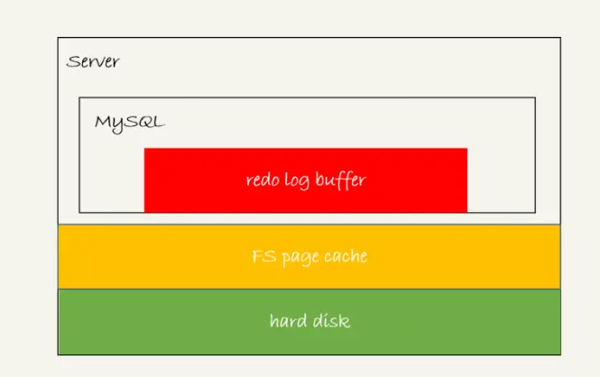

## IO性能和保证

关于持久化的问题，redo log和bin log保持持久化到磁盘，这样就能保证断电重启之后数据可以恢复

分析一下具体的写入流程和看看有那些io参数可以优化性能

### binlog的写入机制

又可以见到万金油，缓存

事务执行的时候，先写缓存，把日志写道binlog cache，事务提交的时候，再把binlog cache写到binlog里面

事务是无法拆分的，于是就要保证，无论事务多大，这个过程要一次写入，这里也涉及到binlog cache保存的问题。太大的话，缓存肯定存不住，要持久化到磁盘上。

系统给 binlog cache 分配了一片内存，每个线程一个，参数 binlog_cache_size 用于控制单个线程内 binlog cache 所占内存的大小。如果超过了这个参数规定的大小，就要暂存到磁盘。

每个线程都有自己的一个cache，但是公用的是同一份binlog

+ 图中的 write，指的就是指把日志写入到文件系统的 page cache，并没有把数据持久化到磁盘，所以速度比较快。cache和cache之前的交流
+ 图中的 fsync，才是将数据持久化到磁盘的操作。一般情况下，我们认为 fsync 才占磁盘的 IOPS。

write 和 fsync 的时机，是由参数 sync_binlog 控制的：

1. sync_binlog=0 的时候，表示每次提交事务都只 write，不 fsync；
2. sync_binlog=1 的时候，表示每次提交事务都会执行 fsync；
3. sync_binlog=N(N>1) 的时候，表示每次提交事务都 write，但累积 N 个事务后才 fsync。

所以，将sync_binlog设置成一个比较大的值的时候，可以提升性能，但是是在有丢失binlog风险的情况下

### redolog的写入机制

同理，也有一个redolog buffer，先写buffer，但是这个buffer不是每次都要持久化到磁盘的。

事务执行期间 MySQL 发生异常重启，那这部分日志就丢了。由于事务并没有提交，所以这时日志丢了也不会有损失。

事务还没提交的时候，redo log buffer 中的部分日志没有可能被持久化到磁盘

实际分析一下redolog buffer的几种状态

1. 存在 redo log buffer 中，物理上是在 MySQL 进程内存中，就是图中的红色部分；
2. 写到磁盘 (write)，但是没有持久化（fsync)，物理上是在文件系统的 page cache 里面，也就是图中的黄色部分；
3. 持久化到磁盘，对应的是 hard disk，也就是图中的绿色部分。

前两个步骤其实是很快的，但是到磁盘的话就比较慢了。

为了控制 redo log 的写入策略，InnoDB 提供了 innodb_flush_log_at_trx_commit 参数，它有三种可能取值：

1. 设置为 0 的时候，表示每次事务提交时都只是把 redo log 留在 redo log buffer 中 ;
2. 设置为 1 的时候，表示每次事务提交时都将 redo log 直接持久化到磁盘；
3. 设置为 2 的时候，表示每次事务提交时都只是把 redo log 写到 page cache。

InnoDB 有一个后台线程，每隔 1 秒，就会把 redo log buffer 中的日志，调用 write 写到文件系统的 page cache，然后调用 fsync 持久化到磁盘。

事务执行中间过程的 redo log 也是直接写在 redo log buffer 中的，这些 redo log 也会被后台线程一起持久化到磁盘。也就是说，一个没有提交的事务的 redo log，也是可能已经持久化到磁盘的。

除了这个轮询，还有两种场景会让一个没有提交事务的redo log写入到磁盘

1. 一种是，redo log buffer 占用的空间即将达到 innodb_log_buffer_size 一半的时候，后台线程会主动写盘。注意，由于这个事务并没有提交，所以这个写盘动作只是 write，而没有调用 fsync，也就是只留在了文件系统的 page cache。
2. 另一种是，并行的事务提交的时候，顺带将这个事务的 redo log buffer 持久化到磁盘。假设一个事务 A 执行到一半，已经写了一些 redo log 到 buffer 中，这时候有另外一个线程的事务 B 提交，如果 innodb_flush_log_at_trx_commit 设置的是 1，那么按照这个参数的逻辑，事务 B 要把 redo log buffer 里的日志全部持久化到磁盘。这时候，就会带上事务 A 在 redo log buffer 里的日志一起持久化到磁盘。

之前的文章分析中，一个两阶段提交，时序上 redo log 先 prepare， 再写 binlog，最后再把 redo log commit。

innodb_flush_log_at_trx_commit 设置成 1，redo log 在 prepare 阶段就要持久化一次，因为有一个崩溃恢复逻辑是要依赖于 prepare 的 redo log，再加上 binlog 来恢复的。

每秒一次后台轮询刷盘，再加上崩溃恢复这个逻辑，InnoDB 就认为 redo log 在 commit 的时候就不需要 fsync 了，只会 write 到文件系统的 page cache 中就够了。

通常我们说 MySQL 的“双 1”配置，指的就是 sync_binlog 和 innodb_flush_log_at_trx_commit 都设置成 1。也就是说，一个事务完整提交前，需要等待两次刷盘，一次是 redo log（prepare 阶段），一次是 binlog。

### 组提交

日志逻辑序列号（log sequence number，LSN），是单调递增的，用来对应 redo log 的一个个写入点。每次写入长度为 length 的 redo log， LSN 的值就会加上 length。

LSN 也会写到 InnoDB 的数据页中，来确保数据页不会被多次执行重复的 redo log

一次组提交的时候，组员越多，效果越好，总的来说就是拖时间。

如果你想提升 binlog 组提交的效果，可以通过设置 binlog_group_commit_sync_delay 和 binlog_group_commit_sync_no_delay_count 来实现。

1. binlog_group_commit_sync_delay 参数，表示延迟多少微秒后才调用 
2. fsync;binlog_group_commit_sync_no_delay_count 参数，表示累积多少次以后才调用 fsync。

WAL主要也是得益于顺序写和组提交的机制的。

### 总结

IO瓶颈的提升计划：

1. 设置 binlog_group_commit_sync_delay 和 binlog_group_commit_sync_no_delay_count 参数，减少 binlog 的写盘次数。这个方法是基于“额外的故意等待”来实现的，因此可能会增加语句的响应时间，但没有丢失数据的风险。
2. 将 sync_binlog 设置为大于 1 的值（比较常见是 100~1000）。这样做的风险是，主机掉电时会丢 binlog 日志。
3. 将 innodb_flush_log_at_trx_commit 设置为 2。这样做的风险是，主机掉电的时候会丢数据。

把 innodb_flush_log_at_trx_commit 设置成 0风险较大，一场重启可能造成数据的丢失。

