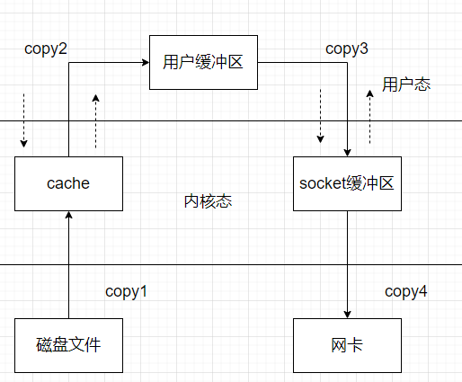

## ZeroCopy

最近摆烂中，发现0拷贝和写时拷贝（写入的时候才做复制，一个缺页异常，但是实际是因为读写权限导致的paging不命中）记混淆了，WTF，所以记录一下ZeroCopy相关的内容。

### why and how

内存拷贝是耗时的，为什么要拷贝呢？

很多应用程序在面临客户端的请求的时候时，可以等价成以下的两步操作：

1. file read（是否阻塞？）
2. send file

在没有任何技术优化的情况下，操作系统会为此进行4次数据拷贝，以及4次上下文切换。

4次copy:

1. cpu讲磁盘数据搬运到page cache
2. cpu负责将内核pagecache的数据搬运到用户态
3. cpu负责将用户数据搬运到socket缓冲区
4. cpu负责将socket缓冲区数据搬运到网络中发送

4次上下文切换也比较明显了

1. read start,进内核态
2. read finish,回用户态
3. write begin，进内核态
4. write finish，回用户态

这么一看简直离谱，内存数据在cpu操控下完成复制尚能接受，磁盘和不可控的网络数据拷贝也都交由这一部分负责，简直离谱。

另外这个切换的上下文开销也过于巨大了，有点难以接受

### DMA

几乎所有的操作系统书籍都会讲DMA吧，就我在remzi的操作系统导论，和其他的现代操作系统，还有上交的银杏书中几乎都看到了DMA的介绍。

DMA 技术就是我们在主板上放一块独立的芯片。在进行内存和 I/O 设备的数据传输的时候，我们不再通过 CPU 来控制数据传输，而直接通过 DMA 控制器（DMA Controller，简称 DMAC）。你可以认为这是一个协处理器，做了部分cpu的事

DMAC 最有价值的地方体现在，当我们要传输的数据特别大、速度特别快，或者传输的数据特别小、速度特别慢的时候。

比如说，我们用千兆网卡或者硬盘传输大量数据的时候，如果都用 CPU 来搬运的话，肯定忙不过来，所以可以选择 DMAC。而当数据传输很慢的时候，DMAC 可以等数据到齐了，再发送信号，给到 CPU 去处理，而不是让 CPU 在那里忙等待。

这里的具体拷贝可以不由cpu去完成了，cpu还是会进行传输过程堆DMAC的控制。

跨设备的拷贝解决了，怎么解决用户态和内核态的这几次拷贝呢。DMA可不能解决同设备的数据交换。

### zerocopy

第一次见到zerocopy是在游双那本linux高性能服务器编程上的高级I/O那一章，整个技术的指导思想就是，我执行操作的时候，CPU不在将数据从某处内存复制到另外一处内存。

CPU此时不全程负责内存中的数据写入另外的部分，仅仅做一个管理。

零拷贝不是不进行拷贝，而是 CPU 不再全程负责数据拷贝时的搬运工作。如果数据本身不在内存中，那么必须先通过某种方式拷贝到内存中（这个过程 CPU 可以不参与），因为数据只有在内存中，才能被转移，才能被 CPU 直接读取计算。

实现的方式也挺多的：

1. sendfile

   > 一次代替 read/write 系统调用，通过使用 DMA 技术以及传递文件描述符，实现了 zero copy

2. mmap

   >  仅代替 read 系统调用，将内核空间地址映射为用户空间地址，write 操作直接作用于内核空间。通过 DMA 技术以及地址映射技术，用户空间与内核空间无须数据拷贝，实现了 zero copy

3. splice

4. 直接 Direct I/O

   >  读写操作直接在磁盘上进行，不使用 page cache 机制，通常结合用户空间的用户缓存使用。通过 DMA 技术直接与磁盘/网卡进行数据交互，实现了 zero copy
   

mmap的机制比较多，单独在内存虚拟化里学习了。这里只看看sendfile相关的机制

### sendfile

snedfile 的应用场景是：用户从磁盘读取一些文件数据后不需要经过任何计算与处理就通过网络传输出去。此场景的典型应用是消息队列。

sendfile 主要使用到了两个技术：

1. DMA
2. 传递文件描述符代替数据拷贝；

**1 利用DMA**

sendfile 依赖于 DMA 技术，将四次 CPU 全程负责的拷贝与四次上下文切换减少到两次

DMA 负责磁盘到内核空间中的 Page cache（read buffer）的数据拷贝以及从内核空间中的 socket buffer 到网卡的数据拷贝。

**2** **传递文件描述符代替拷贝**

传递文件描述可以代替数据拷贝，这是由于两个原因：

1. page cache 以及 socket buffer 都在内核空间中；
2. 数据传输过程前后没有任何写操作；

**注意事项**：只有网卡支持 SG-DMA（The Scatter-Gather Direct Memory Access）技术才可以通过传递文件描述符的方式避免内核空间内的一次 CPU 拷贝。这意味着此优化取决于 Linux 系统的物理网卡是否支持（Linux 在内核 2.4 版本里引入了 DMA 的 scatter/gather – 分散/收集功能，只要确保 Linux 版本高于 2.4 即可）。

**3 一次系统调用代替两次系统调用**

由于 sendfile 仅仅对应一次系统调用，而传统文件操作则需要使用 read 以及 write 两个系统调用。

正因为如此，sendfile 能够将用户态与内核态之间的上下文切换从 4 次降到 2 次。

### 局限

另一方面，我们需要注意 sendfile 系统调用的局限性。如果应用程序需要对从磁盘读取的数据进行写操作，例如解密或加密，那么 sendfile 系统调用就完全没法用。这是因为用户线程根本就不能够通过 sendfile 系统调用得到传输的数据。
