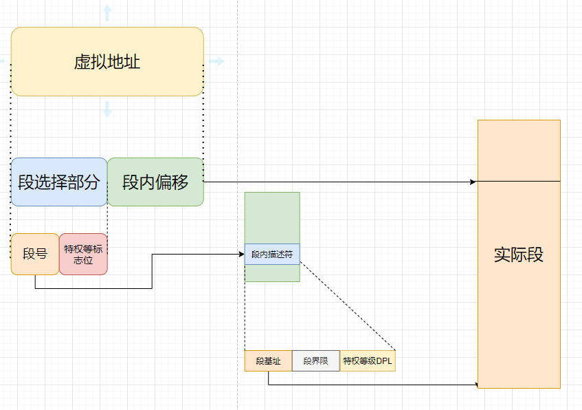

## 内存的虚拟化

早期的时候，一般操作系统都用的绝对内存（参考单片机），同一片内存运行两个程序应该是巨难的。

有一种解决方案就是运行一个进程的时候在内存，要中断切换的时候，把当前内存的信息持久化到磁盘上，之后要恢复现场的时候又回复回来，用jio想都知道这个效率有多低。

后来出现了进程间的隔离，让操作系统为每个进程分配一套虚拟地址，大家都在自己的地方玩，进水不犯河水。

虚拟地址最后访问到实际的绝对地址，操作系统来安排（MMU），这样内存里的东西还在内存，不必为了io妥协

### 地址空间

一个进程操作中能看到的内存空间就是他的地址空间，这是虚拟内存的第一大目标

+ 代码部分
+ 栈
+ heap
+ 一些其他的东西（静态变量等）

我在描述malloc的那篇文章中画了大概的内存分布

第二个目标就是效率，操作系统也会寻求硬件的支持(多级页表和TLB的部分看到的)。

第三个目标就是保护，就是操作系统不会被恶意的黑掉吧，不会被恶意进程所干掉吧，突然想到了用户态和内核态

### 内存接口

首先要知道内存的管理是两级的，你的进程推出的时候内存没有泄露，就是一位这是第一级内存分配

第二级就是malloc和free，这是操作系统交给程序的。从侧面也能理解到，内核的编写是要及其严谨的。

往往两种内存会被分配到，一种就是栈内存，另一种就是堆内存。栈一般都是操作系统自己去管理的，不要你去显示的释放和处理。函数推出之后，这些往往就狗带了。

需要生存周期比较长的就可能需要heap了。这里就是C和C++的优势和弱势的地方。这些申请和释放都需要coder自己去完成，我很赞成bj的一句话，C类语言给程序员最大的信任，你的能力和积累的习惯能够完成当前的要求。

```
int *x = (int *) malloc(sizeof(int));
```

这里堆栈的处理都在这一行上，首先在栈上会申请一个int大小的空间，，然后返回一个地址给int*，提供给你在栈上使用。

比较浮夸的是，一般都以为要有以下的include才能使用malloc

```
#include <stdlib.h>
```

其实在很多平台下是不需要的，加上这个头文件知识为了检测是否正确调用了这个参数。里面的参数是一个size_t类型，其中关于这个类型的问题，我在lseek上踩过坑，大概是int和size_t用混的，具体也不太记得了。传入数字的其实不多见，一般都是宏定义，或者sizeof。另外关于sizeof，其实这是一个关键字，所以你其实可以像下面这样用

```
memset(arry,0x3f,sizeof arry)
```

sizeof()好像才是一个函数。

另外大多数时候，sizeof只知道分配了多大的指针信息，但是

```
int x[N];
sizeof(x);
```

确实是全部的字节数，原因就是数组里提供了多余的静态信息。

最后，关于字符串，有一个好习惯就预留大一点的空间，因为结尾是有一个`/0`的

关于释放

```
free(x);
```

最后还有一些坑，例如strcpy，它里面的dst，是要提前分配空间的，不然也不知道他又多大，过的了编译也会报错。

其实完全可以善用goto语句，比如在END：的地方做一些空间释放判断和处理，在出现一些错误的时候goto END

最后之前写过malloc的简单实现，就是sbrk分配堆区的相关任务。

### 地址转换

怎么虚拟一种假象，虚拟地址从0开始，实际地址从真实物理地址开始，这个映射会有MMU来管理

他会需要一个基址寄存器和判断是否越界的界限寄存器。

实际上管理的方式是分段和分页

### 分段

因为分段之前可能存在的解决方式就是基址寄存器和界限寄存器，这种方式下堆和栈之间存在很多的空闲空间，比较浪费空间，而且，剩下的物理内存不够的时候无法提供连续的空间，可能造成进程的无法执行。

基于这些原因，分段的概念和解决方式被提出了。一个段只是一个地址空间中连续定长的区域，典型的地址空间中存在3-4个不同的段：代码，栈和堆，或者还有数据段。实际上，只有用到了内存才在物理内存中分配空间。

所以可以理解这里再MMU种需要三对这种基址寄存器和界限寄存器。



段选择部分：保存在段寄存器里，最关键的就是段号，其实就是段表里的索引，段表里面保存的就是段的基址，界限，特权等级等。

虚拟地址中的段内偏移：段偏移如果是合法的话，就将段的基址+ offset之后得到物理内存

特权等标志位,里面其实还有些信息是为了共享内存服务的,标识程序是否能够执行该段中的代码,或者读写该段.

分段的缺点就是内存碎片和交换效率低的问题。

首先内存碎片比较好理解，就是中途有程序退出的时候，内存空间中间会空出来一段空闲空间，这个空间的内存是只能被小于他占用空间的程序填充。这个碎片就是外部碎片

而内部碎片就是一个进程地址空间中没有被利用到的空闲内存

解决方式也比较简单，就是swap，把一部分进程的空间先写到磁盘上，然后再在一个连续的位置写入。linux中的swap空间就是干这个事的

实际上，效率低的原因也是因为swap，考虑如果交换的是一个特别大的空间的话.


### 分页


### 最后的机制

