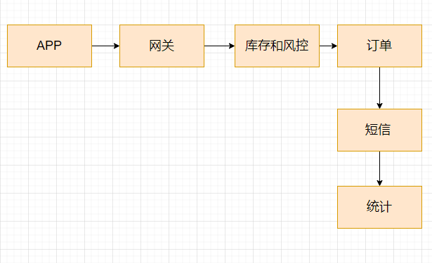
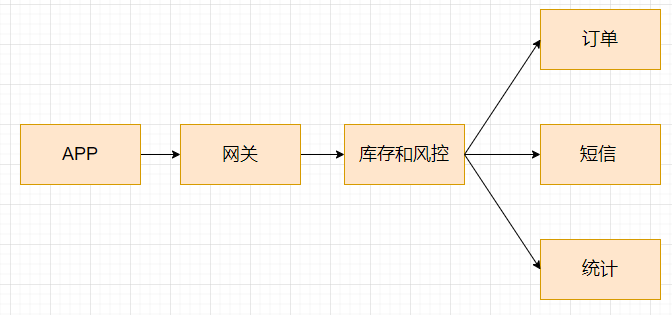

## ZeroMQ

消息+队列=消息队列

本质上其实就是个队列，FIFO，队列中存messgae，但实际实现的时候kafka和zeromq是比这个复杂的多的。

我们需要考虑消息的可靠性，比如用ack机制参考tcp，序列号的标定，是不是要做有些消息的持久化，让整个系统的核心业务更健壮？

还需要考虑消息的吞吐量，简单的REQ-ACK是否能做到高吞吐量（肯定上不去）

多次send，一次ack,肯定比前面的顶，但是能否满足要求

然后是响应速度（批量多大 - 响应速度多少）？业务要达到什么级别？

### 应用场景的话

1. 异步处理
2. 流量控制
3. 服务解耦
4. 发布订阅
5. 高并发的缓存

### 应用举例

比如一个秒杀系统，一个生产者消费者模型

正常的同步处理流程



利用消息队列



等待的时间会减少，并发的处理成为可能

还有一种用处是服务流量的控制，比如在消息队列的水位达到多少的时候给服务器返回信息，减轻后端的服务压力

如果经常触发削峰的话，是要考虑后期加机器的

### 编译安装

必须的库

```
1 sudo apt-get install libtool
2 sudo apt-get install pkg-config
3 sudo apt-get install build-essential
4 sudo apt-get install autoconf
5 sudo apt-get install automake
```

安装加密库

```
git clone git://github.com/jedisct1/libsodium.git
cd libsodium
./autogen.sh -s
./configure && make check
sudo make install
sudo ldconfig
cd ..
```

编译安装zeromq，注意不要先clone到win下再传到linux下，会有编码问题

```
git clone git@github.com:zeromq/libzmq.git
cd libzmq
git tag
# 版本 获取指定的版本，不要⽤主分⽀，可能有bug
git checkout v4.3.2
./autogen.sh
./configure && make check
sudo make install
sudo ldconfig
cd ..
```


