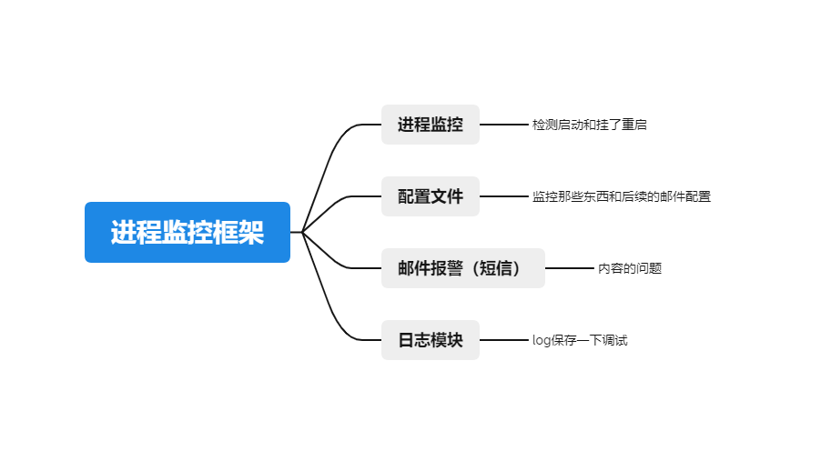

## 进程监控

实际开发的时候发现可能有些东西挂了，但我完全不知道，寻思着能不能写脚本做一个监控的问题

简单的思考一下监控的框架



### 进程的监控部分

寻思用python做还挺方便的，首先就是进程怎么知道是不是还活着呢`os.system`+底下的指令就ok

```
ps -ef | grep nginx | grep -v grep > /dev/null 2>&1
```

启动的话也比较简单，我是自己编译的nginx，就在`/usr/local`下

```
os.system('/usr/local/nginx/sbin/nginx')
```

### 配置文件

主要就是配置监控那些进程和怎么给发邮件的问题了

```
# mysql
[mysql]
aliveCmd = ps -ef |grep "mysql" |grep -v grep 1>/dev/null 2>&1
startCmd = /etc/init.d/mysql start
title = mysql进程监控异常

# nginx监控
[nginx]
aliveCmd = ps -ef |grep "nginx: master process" |grep -v grep 1>/dev/null 2>&1
startCmd = /usr/local/nginx/sbin/nginx 
title = nginx进程监控异常
```

邮件信息

```
# 告警邮件显示的地址列，每个节可自定义(不建议)
ipAddr = 192.168.221.132
# 告警邮件收件人，可用下划线","连接多个邮箱地址
receivers=??????????@qq.com,??????????@qq.com
# 告警邮件发件人地址，建议自定义
sender = XXX@XXX.com
# 告警邮件发件人邮箱SMTP密码
passwd = XXXXXXXXXXX
# 邮箱域名
smtp_server = smtp.exmail.qq.com
smtp_port = 465
# 进程拉起出错时告警间隔时间，单位:分钟
reportInterval = 1
# 告警邮件标题
subject = 实时服务进程监控
```

### 邮件报警

配置和前面一样，主要是格式的问题

|  ip  | 进程id | 所属类型 | 详细 | 时间 |
| :--: | :----: | :------: | :--: | :--: |
|      |        |          |      |      |

### 日志模块

最后的直接每个ret == -1的时候打log模块就行了

然后EXCEPTION也log.error一下